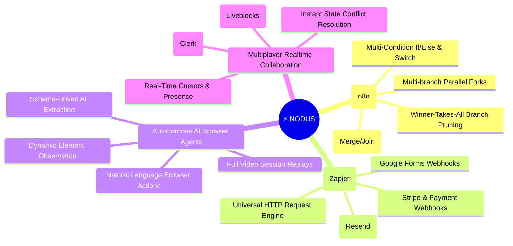
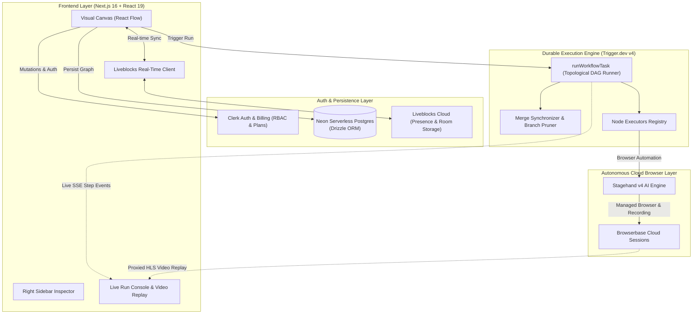

<div align="center">

<br />

# ⚡ Nodus

### The Next-Gen Autonomous AI Workflow & Browser Orchestration Platform

<p><strong>The power of n8n & Zapier, supercharged with autonomous AI browser agents, durable cloud DAG execution, and real-time multiplayer collaboration.</strong></p>

<p>
  <a href="#-the-4-pillars-of-nodus">Core Pillars</a>&nbsp;&nbsp;&bull;&nbsp;&nbsp;
  <a href="#-nodus-vs-traditional-platforms">Comparison</a>&nbsp;&nbsp;&bull;&nbsp;&nbsp;
  <a href="#-workflow-node-ecosystem">Node Ecosystem</a>&nbsp;&nbsp;&bull;&nbsp;&nbsp;
  <a href="#-system-architecture">Architecture</a>&nbsp;&nbsp;&bull;&nbsp;&nbsp;
  <a href="#-engineering-highlights">Engineering</a>&nbsp;&nbsp;&bull;&nbsp;&nbsp;
  <a href="#-quick-start">Quick Start</a>&nbsp;&nbsp;&bull;&nbsp;&nbsp;
  <a href="#-product-roadmap">Roadmap</a>
</p>

<br />

<p>
  &nbsp;
  &nbsp;
  &nbsp;
  &nbsp;
  &nbsp;
  &nbsp;
  &nbsp;
  &nbsp;
  &nbsp;
  &nbsp;
  
</p>

</div>

<br />


<p align="center"><sub>Design complex web automations together on a real-time multiplayer canvas, then observe step-by-step execution and full session replays.</sub></p>

<br />

---

## 🌟 The Vision

Traditional automation tools like **Zapier** and **Make** are great for simple API webhooks, but fail whenever a website lacks a public API or requires complex human-like interactions. On the other hand, classic browser automation scripts (Puppeteer, Playwright) break the moment a CSS selector changes and lack visual workflow management.

**Nodus bridges this gap completely.**

It combines:
1. **Visual DAG Flow Control & Data Routing** (like *n8n*)
2. **Universal Triggers & Webhook Integrations** (like *Zapier*)
3. **Autonomous AI-Driven Browser Infrastructure** (*Stagehand + Browserbase*)
4. **Real-time Multiplayer Collaboration** (*Figma for Automations*)
5. **Fault-Tolerant Background Execution** (*Trigger.dev v4*)

Whether you are scraping dynamic SPAs behind logins, monitoring competitor pricing, automating enterprise SaaS workflows without APIs, or orchestrating multi-step AI pipelines—Nodus gives you a single, unified visual platform.

---

## 💎 The 4 Pillars of Nodus



---

## 📊 Nodus vs. Traditional Platforms

| Capability | Zapier / Make | n8n | Raw Selenium / Playwright | ⚡ **Nodus** |
| :--- | :---: | :---: | :---: | :---: |
| **Visual Flow Canvas** | ✅ | ✅ | ❌ | 🟢 **Yes (React Flow)** |
| **Real-time Multiplayer Collaboration** | ❌ | ❌ | ❌ | 🟢 **Yes (Liveblocks Cursors & Sync)** |
| **AI Autonomous Browser Actions** | ❌ | ❌ | ❌ | 🟢 **Yes (Stagehand v4 AI)** |
| **Handling Sites Without APIs** | ❌ | ❌ | ⚠️ Brittle selectors | 🟢 **Yes (Natural Language & Vision)** |
| **Video Session Replays of Runs** | ❌ | ❌ | ❌ | 🟢 **Yes (Browserbase HLS Replays)** |
| **Multi-Branch DAG & Sibling Pruning** | ⚠️ Limited | ✅ | ⚠️ Code only | 🟢 **Yes (Topological DAG Engine)** |
| **Workflow Portability (JSON Export/Import)**| ⚠️ Proprietary | ✅ | ❌ | 🟢 **Yes (Validated Zod Schema)** |
| **Durable Long-Running Cloud Tasks** | ⚠️ Timeout caps | ⚠️ Self-hosted | ⚠️ DIY Infra | 🟢 **Yes (Trigger.dev v4 Workers)** |

---

## 🧩 Workflow Node Ecosystem

Nodus includes an extensive suite of nodes organized into modular categories:

### 1. Trigger Nodes (Webhook & Schedule Ingestion)
| Node | Type | Description | Key Outputs |
| :--- | :--- | :--- | :--- |
| **Start** | `start` | Manual or scheduled trigger to initiate workflow runs. | `timestamp` |
| **Stripe Webhook** | `stripe-trigger` | Listens for real-time Stripe billing events (`payment_intent.succeeded`, `subscription.created`). | `event`, `customerId`, `amount`, `currency` |
| **Google Forms Webhook** | `google-form-trigger` | Receives live Google Forms submissions via webhook payloads. | `responses`, `email`, `timestamp` |

### 2. Control Flow & Logic Nodes (n8n-Grade Flow Management)
| Node | Type | Description | Key Outputs |
| :--- | :--- | :--- | :--- |
| **If / Else** | `if` | Evaluates multi-condition rule sets (`AND`/`OR`, regex, numeric comparisons, null checks) and splits into `True` / `False` branches. | `result`, `matchedRule` |
| **Switch** | `switch` | Multi-handle router directing execution across custom case branches or a default fallback branch. | `routeIndex`, `matchedValue` |
| **Merge / Join** | `merge` | Synchronizes parallel branch convergence supporting `first` (winner-takes-all), `combine` (map results), and `array` (flatten) modes. | `mergedData`, `branchCount`, `winner` |
| **Wait / Delay** | `wait` | Suspends execution durably for a specified duration in seconds before resuming. | `waitedSeconds`, `resumedAt` |
| **Throw Error** | `throw-error` | Intentionally halts workflow execution with a custom error message for dead-letter handling. | `errorMessage`, `failedAt` |

### 3. Autonomous AI & Cloud Browser Nodes
| Node | Type | Description | Key Outputs |
| :--- | :--- | :--- | :--- |
| **Open URL** | `open-url` | Navigates the isolated cloud browser session to a destination URL. | `url`, `pageTitle`, `status` |
| **Act** | `act` | Executes natural-language actions (*"Click the Sign In button"*, *"Type %password% into input"*). | `success`, `message`, `currentUrl` |
| **Extract** | `extract` | Extracts structured data from web pages using natural language and strict Zod JSON schemas. | `extraction`, `itemCount` |
| **Observe** | `observe` | Discovers interactive elements matching a description and returns candidate selectors. | `matches`, `selector`, `description` |
| **Agent** | `agent` | Autonomous multi-step agent that plans and executes complex end-to-end web tasks. | `success`, `message`, `completedSteps` |

### 4. Integration & Communication Nodes (Zapier Connectivity)
| Node | Type | Description | Key Outputs |
| :--- | :--- | :--- | :--- |
| **HTTP Request** | `http-request` | Performs REST API requests (`GET`, `POST`, `PUT`, `DELETE`, `PATCH`) with custom headers, query params, and JSON payloads. | `status`, `data`, `headers` |
| **Send Email** | `send-email` | Delivers transactional HTML emails via Resend. | `emailId`, `status` |

---

## 🏗️ System Architecture



---

## ⚡ Technical & Engineering Innovations

### 1. Structural Digest Hashing for Zero-Lag Dragging
React Flow triggers canvas updates on every mouse coordinate change (60fps). To eliminate costly graph re-traversals during dragging:
- We compute a deterministic **structural fingerprint** (`nodeId#nodesDigest#edgesDigest`).
- BFS traversal, upstream token generation, and switch edge pruning are completely decoupled from `(x, y)` coordinates, maintaining buttery-smooth 60fps canvas performance even with hundreds of nodes.

### 2. Single-Winner Branch Pruning
When workflows split into parallel execution paths (e.g. attempting 3 fallback login methods), the `MergeSynchronizer` dynamically tracks sibling branch lifecycles:
- As soon as the first winning branch finishes, all sibling branches in the queue are cancelled in real time.
- Prevents wasteful compute and eliminates race conditions.

### 3. Dynamic Zero-Width Token Interpolation
Workflow variables (`{{ NodeId.output }}`) support deep nested properties (`{{ Extract.items[0].price }}`). All string parameters are automatically scrubbed for zero-width characters (`[\u200B\uFEFF\u00A0]`), ensuring clean JSON serialization during third-party API calls.

---

## 🛠️ Tech Stack

- **Framework**: [Next.js 16](https://nextjs.org/) (App Router, React 19 Server Actions)
- **Visual Canvas**: [React Flow / @xyflow/react](https://reactflow.dev/)
- **Multiplayer State**: [Liveblocks](https://liveblocks.io/)
- **Durable Task Engine**: [Trigger.dev v4](https://trigger.dev/)
- **AI Browser Framework**: [Stagehand v4](https://docs.stagehand.dev/)
- **Cloud Browser Sessions**: [Browserbase](https://browserbase.com/)
- **Database & ORM**: [Neon Serverless Postgres](https://neon.tech/) + [Drizzle ORM](https://orm.drizzle.team/)
- **Authentication & Monetization**: [Clerk](https://clerk.com/) (Organizations, Multi-tenancy, Billing)
- **Styling**: [Tailwind CSS](https://tailwindcss.com/) + [shadcn/ui](https://ui.shadcn.com/)
- **Email Service**: [Resend](https://resend.com/)
- **Telemetry & Monitoring**: [Sentry](https://sentry.io/)

---

## 🏁 Quick Start

### Prerequisites
- **Node.js** (v20+) and **npm**
- Accounts for: [Clerk](https://clerk.com/), [Neon](https://neon.tech/), [Trigger.dev](https://trigger.dev/), [Liveblocks](https://liveblocks.io/), [Browserbase](https://browserbase.com/), and [Resend](https://resend.com/).

### 1. Clone & Install
```bash
git clone https://github.com/your-username/nodus.git
cd nodus
npm install
```

### 2. Configure Environment
```bash
cp .env.example .env.local
```

Fill in `.env.local`:
```env
# Clerk Authentication & Billing
NEXT_PUBLIC_CLERK_PUBLISHABLE_KEY=pk_test_...
CLERK_SECRET_KEY=sk_test_...
NEXT_PUBLIC_CLERK_SIGN_IN_URL=/sign-in
NEXT_PUBLIC_CLERK_SIGN_UP_URL=/sign-up
NEXT_PUBLIC_CLERK_SIGN_IN_FALLBACK_REDIRECT_URL=/
NEXT_PUBLIC_CLERK_SIGN_UP_FALLBACK_REDIRECT_URL=/

# Neon Database
DATABASE_URL=postgres://...
DATABASE_URL_UNPOOLED=postgres://...

# Trigger.dev Background Worker
TRIGGER_SECRET_KEY=tr_dev_...

# Liveblocks Real-Time Collaboration
NEXT_PUBLIC_LIVEBLOCKS_PUBLIC_KEY=pk_liveblocks_...
LIVEBLOCKS_SECRET_KEY=sk_liveblocks_...

# Browserbase Cloud Browsers & AI Gateway
BROWSERBASE_API_KEY=bb_...
BROWSERBASE_PROJECT_ID=...

# Resend Email Integration
RESEND_API_KEY=re_...

# Sentry Monitoring
NEXT_PUBLIC_SENTRY_DSN=https://...
SENTRY_AUTH_TOKEN=...
```

### 3. Push Database Schema
```bash
npm run db:push
```

### 4. Start the Background Task Runner
```bash
npx trigger.dev dev
```

### 5. Start the Web App
```bash
npm run dev
```
Navigate to [http://localhost:3000](http://localhost:3000) and build your first workflow.

---

## 🗺️ Product Roadmap

- [x] **Core Visual Canvas with React Flow & Liveblocks**
- [x] **Stagehand v4 AI Browser Actions & Autonomous Agent**
- [x] **Browserbase Video Session Replays**
- [x] **Control Flow Suite (`If/Else`, `Switch`, `Merge/Join`, `Wait`, `Throw Error`)**
- [x] **Universal JSON Workflow Import / Export Engine**
- [ ] **Credential Vault (AES-256-GCM Encrypted Secret Manager)**
- [ ] **Multi-Language Cloud Code Sandbox (Python / JS via E2B)**
- [ ] **Loop & Batch Iteration Nodes (`forEach`, `while`)**
- [ ] **Multi-Agent Orchestration Teams (Supervisor + Specialized Subagents)**
- [ ] **Pre-built Connector Marketplace (Slack, Notion, Discord, GitHub, PostgreSQL)**

---

## 🧪 Verification & Test Suite

```bash
# Run all unit and integration tests (80+ test suites)
npm test

# Run TypeScript typecheck
npm run typecheck

# Run ESLint
npm run lint
```

---

## 📄 License

This project is licensed under the [MIT License](LICENSE).

<br />

<div align="center">
  <sub>Designed & Developed with ❤️. Star ⭐ the repository if you find it inspiring!</sub>
</div>
